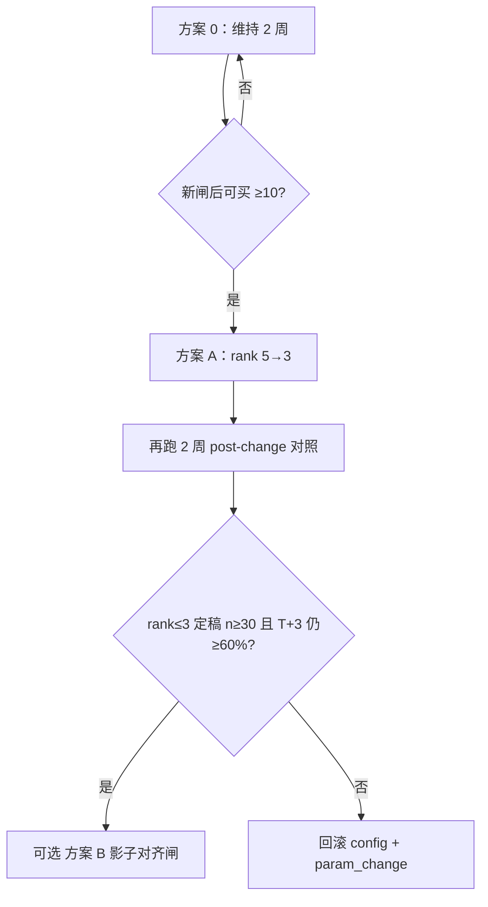

# 影子桶策略 Plan · 2026-09-04

> **状态：已确认（CONFIRMED）— 方案 0** — 2026-09-04 用户确认维持现状、继续攒样本 2 周；**不改闸门、不改代码**。  
> 关联：[`FACTOR_ATTRIB_2026-09-04.md`](FACTOR_ATTRIB_2026-09-04.md)（阶段 2 归因草稿）、**B-P1-05**（闸门微调）、**B-P1-06**（影子桶对照）。  
> 原则：**对照验收 ≠ 可买放行**；任何闸门变更须 `tea config set` + `param_change` 留痕 + CHANGELOG。

---

## 一、触发依据（两条已确认结论）

### 1.1 板块门槛：维持 08-24 收紧，不因总胜率 20% 放松

| 证据（87 条，截至 09-03） | T+1（≥3%） | T+3>0 |
|---------------------------|------------|-------|
| rank≤3 | **36%**（10/28） | **61%**（17/28） |
| rank 4-5 | 19%（3/16） | 40%（6/15） |
| rank>5 | **10%**（4/41） | **21%**（8/39） |

**结论**：板块排名跨 T+1/T+3 单调，是当前最可信粗维度。总胜率 20% 主因是历史「中游追高 + 旧可买口径」，**不是**前排板块门槛过严。

**本 Plan 立场**：❌ 禁止放松 `seed_min_sector_rank` / `sector_relax_rank_nozt` / `scoring.sector_rank_full`；✅ 可考虑在证据更足后**进一步收紧**（见 §三 方案 A）。

### 1.2 影子桶：T+3 对照已达标，可议「萌芽可买」收紧

| 桶 | T+3>0 | n |
|----|-------|---|
| **影子桶合计** | **22/32 = 69%** | 32（≥15 门槛） |
| 前三非突破 | 17/24 = 71% | 24 |
| 萌芽 | 6/10 = 60% | 10 |

验收门槛：`followthrough.t3_up_target = 0.60`（配置可调，**非收益承诺**）。

**含义**：若候选集限定为「萌芽 ∪（非突破 ∧ rank≤3）」，T+3 方向上有统计支撑。  
**不等于**：应立刻把影子桶升格为可买条件——影子桶含大量**观察轨**落盘，且萌芽子桶 n=10 未达 30。

---

## 二、现状：可买闸 vs 影子桶定义

### 2.1 影子桶（只对照，不驱动计划）

```
shadow_tag = 萌芽  ∪  （stage ≠ 突破  ∧  rank ≤ 3）
```

- 落盘：`record_seed` 自动写 `shadow_tag`  
- 统计：`followthrough.shadow_t3_stats`  
- **不写计划、不改 `_winrate_gate`**

### 2.2 当前可买硬闸（`_winrate_gate`）

| 条件 | 现行默认 | 与影子桶关系 |
|------|----------|--------------|
| 突破阶段 | **一律禁买** | 影子桶排除突破 → 一致 |
| 过热阶段 | **一律禁买** | 影子桶可含「前三非突破+过热」→ **不一致** |
| 板块排名 | ≤ **5**（`winrate_sector_rank_buyable_max`） | 影子桶「前三」更严 |
| 入选板块一致性 | `pick_sector_*` 与预审同 bk，rank≤5 | 同上 |
| 胜率分 | `winrate_score ≥ 3` | 影子桶不校验 |
| 共振分 | `total_score ≥ pass_threshold`（通常 6） | 影子桶不校验 |

**关键错位**：

1. 可买允许 **rank 4-5 萌芽**，影子桶「前三非突破」不要 rank 4-5（除非同时标「萌芽」）。  
2. 可买 **禁止过热**，影子桶「前三非突破」可含过热（观察轨落盘）。  
3. 新闸门后可买仅 **1 条**（≥2026-08-26），修闸效果**未验证**。

### 2.3 轨道/阶段提醒（勿误读影子桶）

| 事实 | 解读 |
|------|------|
| 可买轨 0/8 | 支持维持/收紧，不支持放宽 |
| 萌芽 T+1 9% vs 影子桶萌芽 T+3 60% | 萌芽持有逻辑更像看 T+3，不是 T+1 跟涨 |
| 过热 T+1 29% | 旧样本噪声；**明确不做**放开过热 |

---

## 三、可选方案（须择一或组合）

### 方案 0 · 维持现状（**推荐默认**）

**做法**：不改任何闸门；继续日循环 `seed-plan` + `review`，攒「新闸后可买」与因子字段。

| 优点 | 缺点 |
|------|------|
| 新闸样本从 1 条往上长，可验证 08-25 修闸是否有效 | 可买仍可能长期 EMPTY |
| 零回归风险 | 影子桶达标暂时「用不上」 |

**适用**：证据优先、不急于写计划的一周。

**配置**：无变更。

---

### 方案 A · 收紧板块可买上限 5 → 3

**做法**：对齐归因最强信号与影子桶「前三」组件。

```bash
tea config set strategy.seed_min_sector_rank 3
tea config set strategy.winrate_sector_rank_buyable_max 3
tea config set seed.sector_relax_rank_nozt 3
```

| 优点 | 缺点 |
|------|------|
| 与 rank≤3 T+1 36% / T+3 61% 直接对齐 | rank≤3 归因 n=28，差 2 条到 30 |
| 实现零代码，仅 config + param_change | 可买池进一步缩小，EMPTY 更常见 |
| 堵住 rank 4-5 中间带（T+1 ~19%） | 需 2 周 post-change 样本对比 |

**风险**：中间带 rank 4-5 样本少，收紧后可能「错杀」个别有效票——用 post-gate 对照验证。

**推荐度**：⭐⭐⭐（证据够时首选微调）

---

### 方案 B · 新增「影子对齐闸」（仅当 `shadow_tag` 非空才可买）

**做法**：在 `_winrate_gate` 末尾增加可配置开关：

```python
# 伪代码 — 须单独立项 + selftest
if cfg.s("winrate_shadow_align_gate", False):
    tag = compute_shadow_tag(stage, sec_rank, pick_rank)
    if not tag:
        return "非影子桶（萌芽∪前三非突破）→ 降级观察"
```

| 优点 | 缺点 |
|------|------|
| 与影子桶 T+3 69% 定义一致 | **需改代码** + selftest |
| 比单纯 rank≤3 更严（还要萌芽或前三非突破语义） | 萌芽子桶 n=10，单独支撑弱 |
| 可开关回滚 | 与「过热禁买」叠加后，实际可买≈仅萌芽+前三 |

**配置键（拟新增）**：`strategy.winrate_shadow_align_gate`（默认 `false`）

**推荐度**：⭐⭐（样本更足后再上；或作为方案 A 的加强版）

---

### 方案 C · 提高胜率分门槛 3 → 4

**做法**：`tea config set winrate.buyable_threshold 4`

| 优点 | 缺点 |
|------|------|
| 针对「共振 4 分跑赢 5~6 分」现象 | 共振权重重构在「不做」清单 |
| 一行 config | winrate_score 归因 n=14，远不够 |
| | 与影子桶无直接定义关系 |

**推荐度**：⭐（**暂不建议**；等 `scoring_dims` n≥30 再议）

---

### 方案 D · 影子轨独立写计划（影子可买）

**做法**：影子桶达标票单独输出「影子可买」并写计划。

**立场**：❌ **明确反对**

| 原因 |
|------|
| 破坏「对照≠可买」纪律，交易员易混淆 |
| 影子桶含过热观察轨，与 B-W 过热禁买冲突 |
| 无法通过 `param_change` 单独审计「影子买入」盈亏 |

---

### 方案 E · 仅调整 review 计胜口径（萌芽看 T+3）

**做法**：归因/周报对 `stage=萌芽` 单独展示 T+3>0，不改变 `_winrate_gate`。

| 优点 | 缺点 |
|------|------|
| 不改可买，零交易风险 | 不增加可买样本 |
| 帮助理解萌芽 vs T+1 错位 | 属 reporting 增强，非闸门 |

**推荐度**：⭐⭐（可与方案 0 并行，独立小 PR）

---

## 四、决策矩阵（建议）

| 若你的目标是… | 建议 |
|---------------|------|
| 先验证 08-25 修闸是否有效 | **方案 0**（默认） |
| 减少 rank 4-5 误可买、愿意更常 EMPTY | **方案 A**（rank 5→3） |
| 要与影子桶定义严格一致 | **方案 B**（在 A 之后、样本够再开） |
| 尽快多出可买计划 | ❌ 无安全捷径；禁止降 `pass_threshold` / 放开过热 |
| 提高 T+1 跟涨胜率展示 | **方案 E**（reporting only） |

### 4.1 推荐路径（分步，可回滚）



**本周建议**：执行 **方案 0**；并行补 T+1（2）/ T+3（3）待回填，让 rank≤3 满 30 条定稿。

---

## 五、明确禁止（与 project-state 一致）

| 禁止项 | 原因 |
|--------|------|
| 因总胜率 20% **放松**板块门槛 | 归因指向中游追高，非前排过严 |
| 放开过热可买 | 与 B-P0-03b 冲突；影子桶含过热观察 |
| 降 `pass_threshold` / `min_odds` | B-W-01/02 |
| 影子桶达标 → 直接写计划（方案 D） | 对照≠可买 |
| 无 `param_change` 改闸 | 工程铁律 |
| 技术因子 n&lt;30 时动 `bias_penalty` 等 | B-P1-04 未定稿 |

---

## 六、若批准方案 A 的执行清单

- [ ] 用户口头/书面确认方案编号  
- [ ] `tea config set` 三键（见 §3 方案 A）→ 检查 `accumulator.jsonl` 有 `param_change`  
- [ ] 更新 `docs/CHANGELOG.md`、`project-state.md`  
- [ ] 连续 **14 个交易日** `seed-plan` + `review`  
- [ ] 对照指标（post-change vs pre-change）：  
  - [ ] 新闸后可买条数、T+1、T+3  
  - [ ] rank≤3 子集胜率  
  - [ ] EMPTY 天数占比（运营预期管理）  
- [ ] 2 周后回写 [`FACTOR_ATTRIB_2026-09-04.md`](FACTOR_ATTRIB_2026-09-04.md) 或新开定稿节  

## 七、若批准方案 B 的执行清单（代码项）

- [ ] 独立 Plan 确认（在方案 A 跑满 2 周或 rank≤3 定稿后）  
- [ ] `screener._winrate_gate` + `config_store` 新键 `winrate_shadow_align_gate`  
- [ ] `selftest.check_winrate_gate` 覆盖开/关  
- [ ] F03 / `02-api-specs` 文档同步  
- [ ] 默认 `false` 上线，确认后再 `config set true`  

---

## 八、决策记录

| 日期 | 决策 | 说明 |
|------|------|------|
| **2026-09-04** | **方案 0（已确认）** | 维持现状，继续攒样本 **2 周**；不改闸门、不改代码 |

**执行要点（方案 0）**：

1. 每日 `seed-plan` + 适时 `review`，补 T+1（2）/ T+3（3）待回填  
2. 目标：新闸后可买 ≥10 条、rank≤3 定稿 n≥30、布林/技术因子覆盖 ≥30  
3. **2 周后复盘**（约 2026-09-18）：若达标 → 再议方案 A（rank 5→3）；未达标 → 继续方案 0  
4. 板块门槛 **维持 08-24 收紧**，禁止因总胜率 20% 放松  

未选方案（保留待后续）：A（rank 5→3）、B（影子对齐闸）、E（reporting only）。

---

## 九、变更记录

| 日期 | 说明 |
|------|------|
| 2026-09-04 | 首版：板块维持收紧 + 影子桶五方案；推荐方案 0 → A 分步 |
| 2026-09-04 | **用户确认方案 0**：维持现状 2 周，不改闸 |
